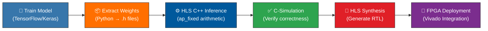
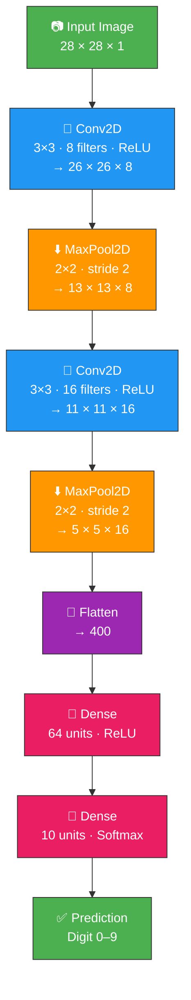
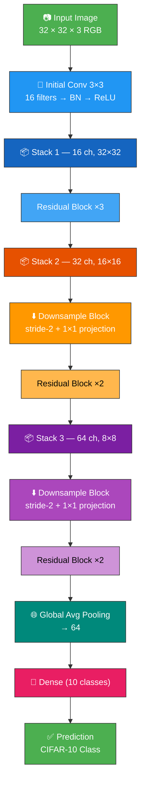
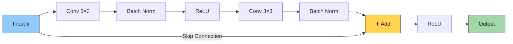
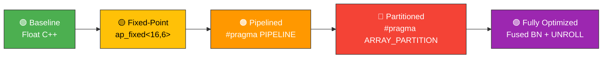
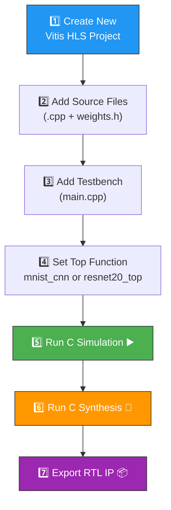

<div align="center">

# 🧠 HLS on AI/ML model

### *From Python to FPGA — End-to-End Deep Learning on Hardware*


<br/>

> 🚀 Hardware-accelerated CNN and ResNet-20 inference engines implemented in synthesizable C++ for Xilinx FPGAs using Vitis HLS, featuring fixed-point arithmetic, AXI interfaces, and aggressive pipeline optimizations.

---

</div>

## 📑 Table of Contents

| Section | Description |
|:--------|:------------|
| [🔄 Pipeline Overview](#-pipeline-overview) | End-to-end workflow from training to FPGA |
| [🏗️ Architecture 1: CNN (MNIST)](#%EF%B8%8F-architecture-1-cnn--mnist) | Compact CNN for digit recognition |
| [🏗️ Architecture 2: ResNet-20 (CIFAR-10)](#%EF%B8%8F-architecture-2-resnet-20--cifar-10) | Deep residual network for image classification |
| [📂 Project Structure](#-project-structure) | File organization and descriptions |
| [⚡ HLS Optimizations](#-hls-optimizations) | Pragmas, fixed-point, and fusion strategies |
| [🚀 Getting Started](#-getting-started) | Build, simulate, and synthesize |
| [🧪 Training & Weights](#-training--weight-extraction) | Reproduce model training |
| [📸 Sample Output](#-sample-output) | Expected inference results |

---

## 🔄 Pipeline Overview

The complete workflow from model training to FPGA deployment:



---

## 🏗️ Architecture 1: CNN — MNIST

> **Task:** Handwritten digit recognition (0–9)  
> **Input:** 28 × 28 × 1 grayscale image  
> **Output:** Predicted digit class

### 📐 Network Diagram



### 📊 Layer Details

| # | Layer | Operation | Input Shape | Output Shape | Params |
|:-:|:------|:----------|:------------|:-------------|-------:|
| 1 | `conv1` | Conv2D (3×3, 8 filters) + ReLU | `28×28×1` | `26×26×8` | 80 |
| 2 | `pool1` | MaxPool2D (2×2, stride 2) | `26×26×8` | `13×13×8` | 0 |
| 3 | `conv2` | Conv2D (3×3, 16 filters) + ReLU | `13×13×8` | `11×11×16` | 1,168 |
| 4 | `pool2` | MaxPool2D (2×2, stride 2) | `11×11×16` | `5×5×16` | 0 |
| 5 | `flatten` | Flatten | `5×5×16` | `400` | 0 |
| 6 | `dense1` | Dense (64 units) + ReLU | `400` | `64` | 25,664 |
| 7 | `output` | Dense (10 units) + Softmax | `64` | `10` | 650 |
| | | | | **Total** | **27,562** |

---

## 🏗️ Architecture 2: ResNet-20 — CIFAR-10

> **Task:** 10-class image classification (airplane, automobile, bird, cat, deer, dog, frog, horse, ship, truck)  
> **Input:** 32 × 32 × 3 RGB image  
> **Output:** Class probabilities

### 📐 Network Diagram



### 🔁 Residual Block Detail



### 📊 Stack Configuration

| Stack | Channels | Spatial Size | Blocks | Conv Type |
|:-----:|:--------:|:------------:|:------:|:----------|
| 🟦 1 | 16 | 32 × 32 | 3 × Basic | stride-1, 3×3 |
| 🟧 2 | 32 | 16 × 16 | 1 Downsample + 2 Basic | stride-2 → stride-1 |
| 🟪 3 | 64 | 8 × 8 | 1 Downsample + 2 Basic | stride-2 → stride-1 |

---

## 📂 Project Structure

```
HLS_Project/
│
├── 🐍 Training Notebooks
│   ├── CNN.ipynb                          ← Train CNN on MNIST
│   └── resnet20_cifar.ipynb               ← Train ResNet-20 on CIFAR-10
│
├── ⚙️ HLS C++ Source (CNN)
│   ├── cnn.cpp                            ← Floating-point C-Sim version
│   └── cnn_on_mnist_without_array_        ← Fixed-point HLS with pragmas
│       partitioning.cpp                      (ap_fixed, PIPELINE, AXI)
│
├── ⚙️ HLS C++ Source (ResNet-20)
│   ├── resnetcnn.cpp                      ← Baseline HLS implementation
│   └── resnetcnn_optimized.cpp            ← Optimized (fused BN, PARTITION, UNROLL)
│
├── 🧪 Testbenches
│   ├── main.cpp                           ← CNN test — synthetic input
│   ├── main2.cpp                          ← CNN test — loads real PNG
│   └── main_resnet.cpp                    ← ResNet-20 test
│
├── 📦 Weights (Auto-Generated)
│   ├── weights.h                          ← CNN weights (ap_fixed<16,6>)
│   └── resnet_weights.h                   ← ResNet-20 weights (~2.8 MB)
│
├── 🖼️ Image Utilities
│   ├── stb_image.h / stb_image_write.h   ← stb image library
│   ├── stb_image.cpp                      ← stb implementation
│   └── igl_stb_image.h / .cpp            ← IGL wrapper
│
├── 🖼️ Test Images
│   ├── my_digit.png                       ← Sample 28×28 digit
│   └── my_digit2.png                      ← Additional test digit
│
└── 🔧 Build & Config
    ├── CMakeLists.txt                     ← CMake config
    ├── .gitignore
    └── .gitattributes
```

> [!NOTE]
> `resnet20.h` (containing `data_t`, `weight_t`, `IMAGE_SIZE`, `NUM_CLASSES` type definitions) is referenced by the ResNet source files. Create this header in your Vitis HLS project or define the types manually.

---

## ⚡ HLS Optimizations

The project demonstrates **progressive optimization** — from pure C++ to fully synthesizable, pipelined hardware:



### 📋 Optimization Matrix

| Optimization | File | What It Does | Impact |
|:-------------|:-----|:-------------|:-------|
| 🟢 **Floating-Point Baseline** | `cnn.cpp` | Pure `float` C++ for golden reference | ✅ Functional verification |
| 🟡 **Fixed-Point Types** | `cnn_on_mnist_*.cpp` | `ap_fixed<16,6>` — 16-bit, 6 int + 10 frac | ⚡ 4× less BRAM vs float |
| 🟠 **Loop Pipelining** | `cnn_on_mnist_*.cpp` | `#pragma HLS PIPELINE II=1` on inner loops | ⚡ 1 output per clock cycle |
| 🔴 **Array Partitioning** | `resnetcnn_optimized.cpp` | `#pragma HLS ARRAY_PARTITION cyclic factor=4` | ⚡ 4× parallel memory reads |
| 🔵 **Loop Unrolling** | `resnetcnn_optimized.cpp` | `#pragma HLS UNROLL factor=4` on input channels | ⚡ 4× parallel MACs |
| 🟣 **Fused BN + ReLU** | `resnetcnn_optimized.cpp` | Batch norm + activation in single pass (in-place) | ⚡ 50% less memory traffic |
| ⚪ **Wider Accumulators** | `resnetcnn_optimized.cpp` | `ap_fixed<32,16>` for intermediate sums | ✅ Prevents overflow |
| 🔶 **AXI Interfaces** | Both HLS versions | `m_axi` for image, `s_axilite` for control | ✅ SoC-ready IP block |

### 🔌 HLS Interface Configuration

```
┌──────────────────────────────────────────────┐
│               FPGA IP Core                    │
│                                              │
│   ┌─────────────┐     ┌──────────────────┐   │
│   │  s_axilite  │◄───►│  Control (CTRL)  │   │
│   │  (CPU bus)  │     │  Start/Done/Idle │   │
│   └─────────────┘     │  prediction reg  │   │
│                       └──────────────────┘   │
│   ┌─────────────┐     ┌──────────────────┐   │
│   │   m_axi     │◄───►│  Image Memory    │   │
│   │ (DDR bus)   │     │  (gmem bundle)   │   │
│   └─────────────┘     └──────────────────┘   │
│                                              │
│         [ Neural Network Compute ]           │
│                                              │
└──────────────────────────────────────────────┘
```

---

## 🚀 Getting Started

### 📋 Prerequisites

| Tool | Version | Purpose |
|:-----|:--------|:--------|
| 🔧 Xilinx Vitis HLS | 2022.2+ | Synthesis, C-Sim, Co-Sim |
| 🖥️ g++ / MSVC | C++11+ | Standalone C-Simulation |
| 🐍 Python | 3.8+ | Model training |
| 📦 TensorFlow | 2.x | Keras model training |

### ▶️ Option 1: Standalone C-Simulation (No Xilinx needed)

**CNN — Floating-Point (quick test):**

```bash
g++ -o cnn_test main.cpp cnn.cpp -std=c++11
./cnn_test
```

**CNN — With Real Image Input:**

```bash
g++ -o cnn_real main2.cpp cnn.cpp stb_image.cpp -std=c++11
./cnn_real      # reads my_digit.png (28×28 grayscale)
```

### ▶️ Option 2: Vitis HLS C-Simulation



| Model | Source File | Testbench | Top Function |
|:------|:-----------|:----------|:-------------|
| CNN (MNIST) | `cnn_on_mnist_without_array_partitioning.cpp` | `main.cpp` or `main2.cpp` | `mnist_cnn` |
| ResNet-20 (CIFAR-10) | `resnetcnn_optimized.cpp` | `main_resnet.cpp` | `resnet20_top` |

---

## 🧪 Training & Weight Extraction

<details>
<summary>📓 <strong>CNN — MNIST Training</strong> (click to expand)</summary>

### Steps

1. Open `CNN.ipynb` in **Jupyter** or **Google Colab**
2. The notebook will:
   - Load MNIST dataset (60K train / 10K test images)
   - Normalize pixel values to `[0.0, 1.0]`
   - Build & train a compact CNN (5 epochs, ~98%+ accuracy)
   - Extract all weights/biases into **`weights.h`** as flattened C arrays

### Model Architecture (Keras)

```python
model = Sequential([
    Conv2D(8,  (3,3), activation='relu', input_shape=(28,28,1)),
    MaxPooling2D((2,2)),
    Conv2D(16, (3,3), activation='relu'),
    MaxPooling2D((2,2)),
    Flatten(),
    Dense(64, activation='relu'),
    Dense(10, activation='softmax')
])
```

### Weight Format

```c
// Auto-generated in weights.h
const float conv1_weights[72] = { ... };
const float conv1_biases[8]   = { ... };
// ... all layers
```

</details>

<details>
<summary>📓 <strong>ResNet-20 — CIFAR-10 Training</strong> (click to expand)</summary>

### Steps

1. Open `resnet20_cifar.ipynb` in **Jupyter** or **Google Colab**
2. The notebook will:
   - Load CIFAR-10 dataset with data augmentation (shifts + horizontal flips)
   - Build ResNet-20 (depth=20 → 3 residual blocks per stack)
   - Train for 150 epochs with learning rate scheduling
   - Export **all** conv weights, BN parameters (γ, β, μ, σ²), and dense layer weights into **`resnet_weights.h`**

### Weight Format

```c
// Auto-generated in resnet_weights.h (ap_fixed<16,6>)
const weight_t layer_1_weights[432]  = { ... };  // Initial conv
const weight_t layer_2_gamma[16]     = { ... };  // BN gamma
const weight_t layer_2_beta[16]      = { ... };  // BN beta
const weight_t layer_2_mean[16]      = { ... };  // BN running mean
const weight_t layer_2_variance[16]  = { ... };  // BN running variance
// ... 70 layers total
```

</details>

---

## 📸 Sample Output

### ✅ CNN — MNIST

```
--- MNIST HLS C-Simulation ---
Input image generated (Simulated '1').
Running Inference...

===================================
   NETWORK PREDICTION: 1
===================================
```

### ✅ ResNet-20 — CIFAR-10

```
Generating test image data...
Starting ResNet-20 Inference...
Inference Complete!

===================================
        CLASS PREDICTIONS           
===================================
Class 0: -0.234
Class 1:  0.891
Class 2:  0.112
...
Class 9:  0.045
```

---

## 🛠️ Tech Stack

<div align="center">

| Category | Technology |
|:---------|:-----------|
| 🧠 Training Framework | TensorFlow / Keras |
| ⚙️ Hardware Description | Vitis HLS C++ |
| 🔢 Fixed-Point Library | Xilinx `ap_fixed<16,6>` |
| 📐 Math Library | Xilinx `hls_math.h` |
| 🖼️ Image Loading | stb_image (public domain) |
| 🔌 FPGA Interfaces | AXI4 Master + AXI4-Lite |
| 🏗️ FPGA Synthesis | Xilinx Vivado + Vitis HLS |

</div>

---

## 📄 License

This project is for **educational and research purposes**.

- The `stb_image` library is in the **public domain** — see [nothings/stb](https://github.com/nothings/stb)
- Neural network architectures are based on published research papers

---

<div align="center">

⭐ **If you found this project helpful, consider giving it a star!** ⭐

---

*Built with ❤️ for hardware-accelerated deep learning*

</div>
